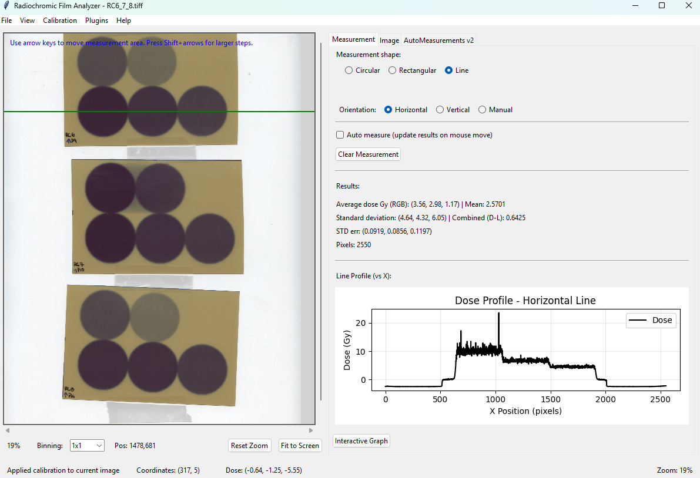
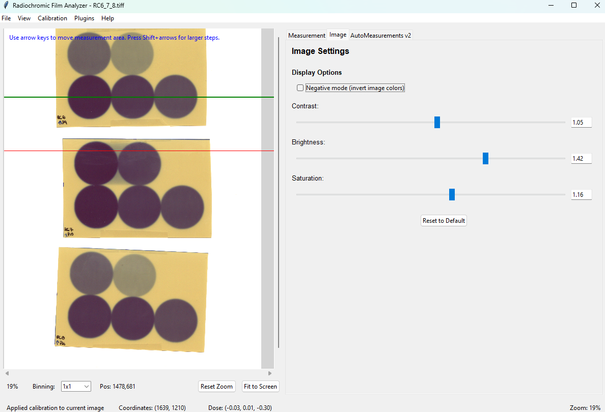
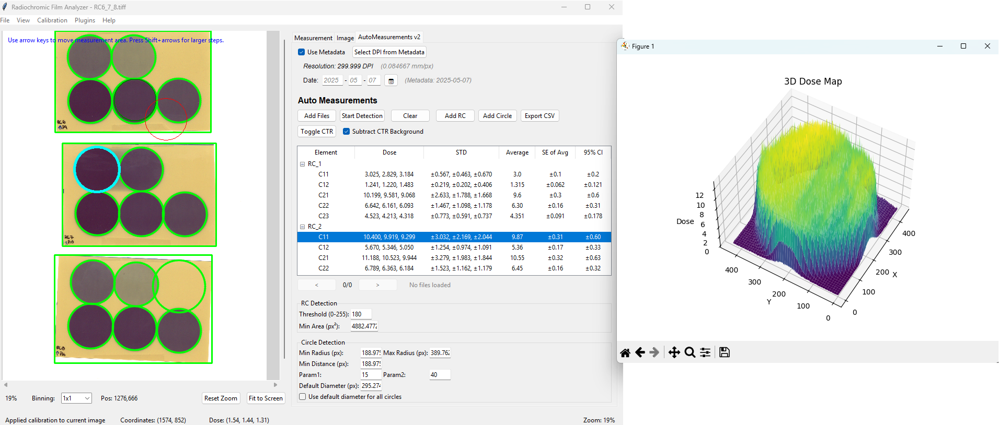

# Radiochromic-Scanning-Tool

## Overview

The Radiochromic-Scanning-Tool is a specialized application designed for the analysis and measurement of radiochromic films used in medical physics and radiation dosimetry. This tool provides precise measurements, visualization, and analysis capabilities for researchers and medical physicists.

<h3 align="center">Main Interface</h3>
<p align="center">
  
</p>

<h3 align="center">Image Interface</h3>
<p align="center">
  
</p>

<h3 align="center">Auto Measurements Interface</h3>
<p align="center">
  
</p>
## Features

- **Image Processing**: Open, view, and analyse radiochromic film images.
- **Measurement Tools**: Circular, rectangular and line-profile regions with adjustable size; instant numeric preview under the cursor.
- **Auto-Measurements**: Built-in plugin that automatically detects circular ROIs, computes dose & uncertainty and exports results to CSV in one click.
  - **Matrix-Based Circle Naming**: Circles are automatically named based on spatial position (C11, C12, C21, C22...) where first digit = row, second digit = column
  - **Y-Coordinate Clustering**: Intelligent row detection groups circles by Y-position
  - **Multi-File Support**: Process multiple radiochromic films in batch
- **Statistical Analysis**: Average pixel / dose values, standard deviation and fully propagated uncertainty, both per-channel and averaged.
- **Advanced Uncertainty Estimation**:
  - Multiple methods for combining channel uncertainties: Weighted Average, Birge Factor, DerSimonian-Laird
  - Configurable in Settings dialog
  - Proper distinction between Standard Deviation (STD) and Standard Error (SE)
  - Full uncertainty propagation through calibration curves
- **Enhanced CSV Export**:
  - Filename column (first column)
  - Date column with metadata extraction support
  - Proper STD vs SE (Standard Error) distinction
  - 95% Confidence Interval calculation (SE × 1.96)
  - Clean numeric formatting for spreadsheet compatibility
- **Consistent Formatting**: Values and uncertainties share matching precision (two decimals for calibrated dose) across the UI and CSV export.
- **Visualization**:
  - Real-time RGB / dose histograms
  - 2-D heat maps of intensity or dose distribution
  - 3-D surface plots of RGB channels or dose
- **Calibration**: Non-linear calibration against reference doses with full uncertainty propagation; toggle on/off instantly.
- **Performance**: Multithreading, optional GPU acceleration (CuPy) and on-the-fly binning (2×, 4×…) for large images.
- **Plugins & Extensibility**: Load/unload external Python plugins directly from the GUI for custom workflows.
- **Image Enhancement**: Contrast, brightness, saturation and negative mode.
- **Configuration**: All settings are saved automatically between sessions.

## Installation

### Prerequisites

- Python 3.7 or higher
- Required Python packages:
  - tkinter (included with standard Python on Windows/macOS)
  - numpy
  - matplotlib
  - pillow (PIL)
  - scipy (for 2-D/3-D visualisation)
  - opencv-python (CV2 image processing & fast statistics)
  - scikit-image (required for auto-measurements plugin)
  - cupy-cuda** (optional, for GPU acceleration – choose the build matching your CUDA version)

### Installation Steps

1. Clone the repository or download the source code:
   ```
   git clone https://github.com/yourusername/radiochromic-film-analyzer.git
   cd radiochromic-film-analyzer
   ```

2. Install the required dependencies:
   ```
   pip install -r requirements.txt
   ```

3. Run the application:
   ```
   python main.py
   ```

## Usage Guide

### Opening an Image

1. Click on "File" → "Open" 
2. Select a radiochromic film image file (supported formats: TIFF)
3. The image will be displayed in the main window

### Taking Measurements

1. Select the measurement shape (circular or square) in the Measurement panel
2. Adjust the measurement size using the spinbox or Ctrl+Mouse Wheel
3. Move your cursor over the image to see the measurement region
4. Click on the area you want to measure
5. View the measurement results in the Results section

### Visualizing Data

- **Histogram**: Automatically updates with each measurement
- **2D View**: Click the "2D View" button to see a heat map of intensity values
- **3D View**: Click the "3D View" button to see a 3D surface plot of RGB channels

### Adjusting Image Settings

1. Use the sliders in the Image Settings panel to adjust:
   - Contrast
   - Brightness
   - Saturation
2. Toggle "Negative mode" to invert image colors

### Using Auto-Measurements Plugin

#### Automatic Circle Detection with Matrix Naming
1. Open one or more radiochromic film images
2. Navigate to the "AutoMeasurements" tab
3. Click "Add Files" to load multiple images for batch processing
4. Adjust detection parameters if needed:
   - Film detection: Canny thresholds, morphology kernel
   - Circle detection: Hough parameters, diameter restrictions
5. Click "Start Detection"
6. Circles will be automatically detected and named based on their spatial position:
   - **C11** = First row, first column (top-left)
   - **C12** = First row, second column
   - **C21** = Second row, first column
   - **C34** = Third row, fourth column
   - etc.

#### Understanding Circle Names
- **First digit**: Row number (1 = top, 2 = second from top, etc.)
- **Second digit**: Column number (1 = leftmost, 2 = second from left, etc.)
- **"M" suffix**: Manually added circles (e.g., C1M, C2M) to distinguish from auto-detected

#### CSV Export Features
1. After detection, click "Export CSV"
2. Choose save location
3. The CSV will include:
   - **Filename**: Extracted automatically from image path
   - **Date**: From metadata or manual input
   - **Film & Circle**: With matrix naming (RC_1, C11, etc.)
   - **95% CI**: Automatically calculated (SE × 1.96)
   - **Clean numbers**: No ± symbols for easy spreadsheet processing

#### Multi-File Workflow
1. Click "Add Files" and select multiple TIFF images
2. Use navigation buttons (< >) to switch between files
3. File counter shows current position (e.g., "2/5")
4. Each file maintains its own:
   - Detected circles and measurements
   - CTR (control) circle assignments
   - Detection parameters
5. Export CSV to combine all files into one spreadsheet

#### CTR (Control) Background Subtraction
1. Select a circle designated as background/control
2. Click "Toggle CTR" or ctrl+click to mark it as control circle
3. Check "Subtract CTR Background" to enable subtraction
4. Background dose will be subtracted from all other circles in the same film
5. CTR circles shown with dashed outline in visualization

### Calibration

1. Click on "Tools" → "Calibration Wizard"
2. Follow the on-screen instructions to calibrate your measurements

### Configuring Uncertainty Estimation

1. Go to "File" → "Settings"
2. Scroll to "Uncertainty Estimation" section
3. Select your preferred method:
   - **weighted_average**: Standard approach, recommended for most cases
   - **birge_factor**: Accounts for excess channel-to-channel scatter
   - **dersimonian_laird**: Most conservative, includes systematic uncertainties
4. Click "Apply" to save changes
5. Existing measurements will be recalculated with the new method

**When to use each method**:
- Use **Weighted Average** for routine measurements with consistent channels
- Use **Birge Factor** if RGB channels show more variation than expected
- Use **DerSimonian-Laird** for maximum conservatism or when channels may have systematic differences

### Saving Configuration

- The application automatically saves your settings when you exit
- Settings are stored in `rc_config.json` in the application directory

## Keyboard Shortcuts

- **Ctrl+Left click**: Select circle as control
- **Ctrl+Mouse Wheel**: Adjust measurement size
- **Mouse Wheel**: Zoom in/out

### Error Logs

- Error logs are stored in `rc_analyzer.log` in the application directory
- Check this file for detailed error information if you encounter issues

## Recent Updates

#### Matrix-Based Circle Naming System
- **Spatial Organization**: Circles are automatically organized into a grid matrix based on their physical position
- **Intuitive Naming**: Circles named as C{row}{column} (e.g., C11, C12, C21, C34)
  - First digit = row number (top to bottom)
  - Second digit = column number (left to right)
- **Smart Row Detection**: Y-coordinate clustering algorithm groups circles into rows with configurable tolerance (avg_radius × 0.5)
- **Auto-sorting**: Within each row, circles are sorted left-to-right by X-coordinate
- **Manual Circle Distinction**: Manually added circles use C{n}M naming (e.g., C1M, C2M) to distinguish from auto-detected circles

#### Advanced Uncertainty Estimation Methods
The application now supports three sophisticated methods for combining uncertainties from RGB channels:

1. **Weighted Average** (Default recommended for most cases)
   - Combines channel measurements weighted by inverse variance
   - Formula: `w_i = 1/σ²_i`, `μ = Σ(w_i × x_i) / Σ(w_i)`
   - Combined uncertainty: `σ_combined = 1/√(Σw_i)`
   - Best for: Standard measurements with normally distributed uncertainties

2. **Birge Factor** (For handling inconsistent channel measurements)
   - Applies scaling factor when channel-to-channel scatter exceeds expected uncertainty
   - Birge ratio: `R_B = χ²_reduced / √(2/(N-1))`
   - If R_B > 1: scales uncertainties by R_B to account for excess scatter
   - Best for: Measurements where channels show more variation than expected
   - Prevents underestimation of uncertainty when channels disagree
   - **Reference**: Birge, R.T. (1932). "The Calculation of Errors by the Method of Least Squares". Physical Review, 40(2), 207-227. doi:10.1103/PhysRev.40.207

3. **DerSimonian-Laird** (Meta-analysis approach)
   - Adds between-channel variance (τ²) to within-channel variance
   - Iteratively estimates heterogeneity between channels
   - Formula: `τ² = max(0, (Q - (N-1)) / C)` where Q is Cochran's Q statistic
   - Best for: When channels may have systematic differences
   - Most conservative approach, accounts for both random and systematic uncertainties
   - **Reference**: DerSimonian, R. & Laird, N. (1986). "Meta-analysis in clinical trials". Controlled Clinical Trials, 7(3), 177-188. doi:10.1016/0197-2456(86)90046-2

**Method Selection**: Configure in `Settings → Uncertainty Estimation → Method for combining channel uncertainties`

**Technical Details**:
- All methods properly propagate uncertainties through calibration curves
- Uncertainty calculations are performed using the selected method for each measurement

#### CSV Column Structure
The exported CSV now contains 11 columns in this order:
1. **Filename** - Image filename (without path)
2. **Date** - Measurement date (from metadata or manual input)
3. **Film** - Film identifier (RC_1, RC_2, etc.)
4. **Circle** - Circle identifier with matrix naming (C11, C12, etc.)
5. **doses_per_channel** - Dose values per RGB channel
6. **STD_doses_per_channel** - Standard deviation per channel 
7. **average** - Average dose value
8. **SE_average** - Standard error of average (4 decimals)
9. **95%confident_interval(SE)** - 95% CI = SE × 1.96 (4 decimals)
10. **pixel_count** - Number of pixels in measurement
11. **uncertainty_calculation_method** - Method used (e.g., dersimonian_laird)


#### Algorithm Details
The matrix organization algorithm works as follows:
1. Sort all detected circles by Y-coordinate
2. Group circles into rows using Y-clustering (tolerance = avg_radius × 0.5)
3. Sort rows from top to bottom
4. Within each row, sort circles left to right by X-coordinate
5. Assign names: C{row_idx}{col_idx}

Example result for 3×4 grid:
```
Row 1: C11, C12, C13, C14
Row 2: C21, C22, C23, C24
Row 3: C31, C32, C33, C34
```

## License

This project is licensed under the GNU GPL v3 - see the LICENSE file for details.

## References

### Uncertainty Estimation Methods

1. **Birge, R.T.** (1932). "The Calculation of Errors by the Method of Least Squares". *Physical Review*, 40(2), 207-227.  
   DOI: [10.1103/PhysRev.40.207](https://doi.org/10.1103/PhysRev.40.207)  
   *Classic paper introducing the Birge ratio for handling inconsistent measurements in weighted averages.*

2. **DerSimonian, R. & Laird, N.** (1986). "Meta-analysis in clinical trials". *Controlled Clinical Trials*, 7(3), 177-188.  
   DOI: [10.1016/0197-2456(86)90046-2](https://doi.org/10.1016/0197-2456(86)90046-2)  
   *Foundational work on random-effects meta-analysis, widely used for combining measurements with heterogeneity.*

## Acknowledgments

- This software was developed for research purposes in the field of medical physics and radiophysics. It is provided “as is”, without any warranty of any kind. The developer assumes no responsibility or liability for any use, misuse, or results obtained from the use of this software. Use of this software is entirely at your own risk.

- This software was developed partially with the assistance of GitHub Copilot.

