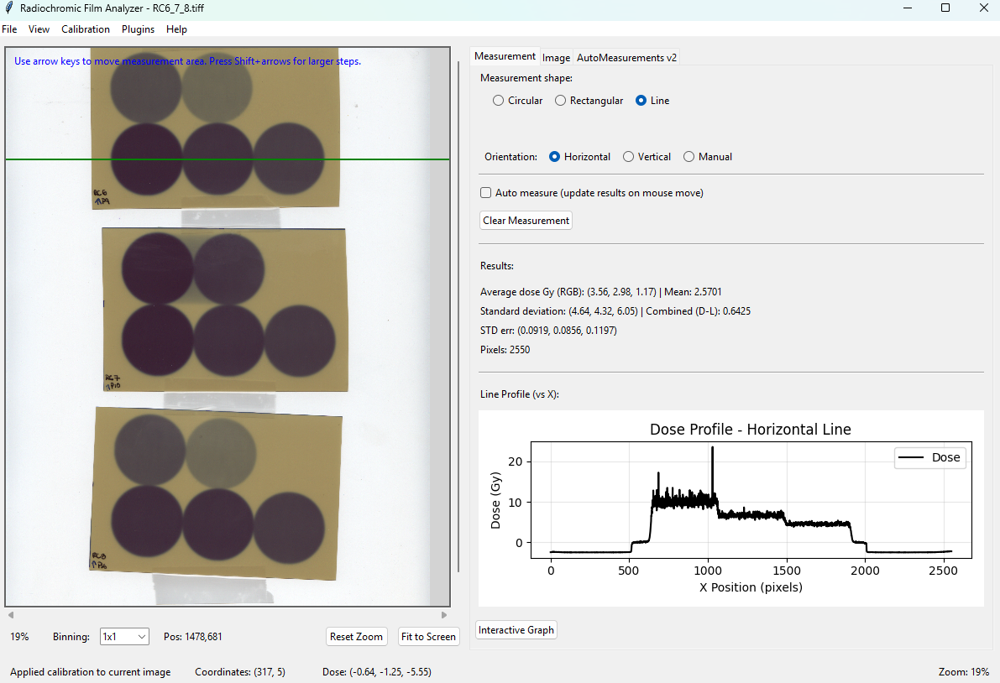

# Radiochromic Scanning Tool

Aplicación de escritorio para analizar imágenes de película radiocrómica, construir calibraciones dosis–respuesta, corregir la respuesta espacial del escáner y exportar medidas con incertidumbre y trazabilidad.

<p align="center">
  
</p>

## Funciones principales

- Lectura TIFF conservando la profundidad de almacenamiento de 8 o 16 bits y rutas Unicode.
- Corrección flat-field ligada a la geometría del escáner.
- Calibración no lineal independiente para los canales R, G y B.
- Medidas circulares, rectangulares y perfiles de línea.
- Propagación de la covarianza completa de los parámetros de calibración.
- Combinación RGB por varianza inversa, factor de Birge o DerSimonian–Laird.
- Detección y medida automática de películas y regiones.
- Sustracción de controles CTR locales o globales con covarianza.
- Análisis de centroides, isodosis y regresión lineal ponderada.
- Procesamiento de varios archivos y exportación CSV versionada.
- Manifiestos SHA-256 para identificar y verificar cada calibración.

## Instalación

Requiere Python 3.10 o posterior. En Windows, `tkinter` se incluye en la instalación estándar de Python.

```powershell
python -m venv .venv
.venv\Scripts\Activate.ps1
python -m pip install -r requirements.txt
python main.py
```

La aceleración CUDA es opcional y requiere una compilación de OpenCV/CuPy compatible con el equipo. El procesamiento por CPU contiene toda la funcionalidad científica.

## Flujo recomendado

1. Adquirir blancos y películas manteniendo resolución, orientación, profundidad de bits y protocolo de escaneo.
2. Ejecutar `Tools → Calibration Wizard` para generar el flat-field y el ajuste dosis–respuesta.
3. Seleccionar la carpeta de calibración en la configuración.
4. Abrir las imágenes y activar la corrección flat-field y/o la conversión a dosis.
5. Medir ROIs manualmente o usar `AutoMeasurements`.
6. Revisar las regiones extrapoladas o no válidas y exportar el CSV.

La extrapolación está desactivada por defecto. Un flat-field con dimensiones diferentes a la imagen se rechaza salvo que se habilite expresamente su redimensionado.

## Documentación técnica

- [Modelo matemático e incertidumbre](docs/MATHEMATICAL_MODEL.md)
- [Flujos de calibración y análisis](docs/WORKFLOWS.md)
- [Formatos, configuración y trazabilidad](docs/DATA_FORMATS.md)

## Pruebas

```powershell
python -m unittest discover -s tests -v
python -m compileall -q app custom_plugins tests main.py
```

La integración continua ejecuta estas comprobaciones en Windows con Python 3.10 y 3.12.

## Alcance científico

El programa conserva los valores numéricos de adquisición y documenta la propagación interna de incertidumbre. La validez metrológica final depende además del protocolo experimental: estabilidad del escáner, orientación y posición de las películas, tiempo postirradiación, lote, dosis de referencia y diseño de la calibración. Los resultados deben validarse para el sistema de medida concreto.

## Licencia

GNU General Public License v3.0. Consulte [LICENSE](LICENSE).
